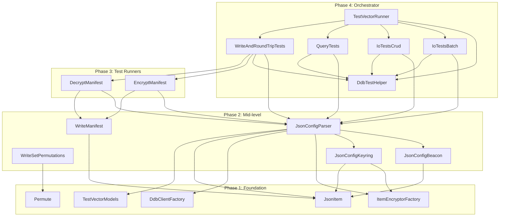
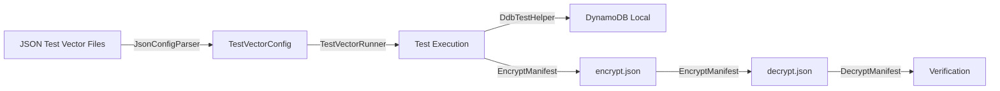

# Design Document: Native Java Test Vectors

## Overview

This design describes the rewrite of the AWS Database Encryption SDK DynamoDB test vector harness from Dafny-transpiled Java to idiomatic native Java. The current implementation consists of ~4600 lines of Dafny across 10 `.dfy` files that get transpiled to Java, depending on `DafnyRuntime`, `smithy-dafny-conversion`, `ToDafny/ToNative` bridge classes, and `internaldafny` types. The rewrite eliminates all Dafny dependencies, calling native DBESDK and MPL APIs directly.

The same JSON test vector files are preserved — only the harness code changes. The test contract remains identical: same inputs produce same outputs.

### Goals

- Remove all Dafny runtime dependencies from the test vector harness
- Use idiomatic Java patterns (standard collections, exceptions, naming conventions)
- Call native DBESDK and MPL APIs directly
- Maintain identical test coverage and behavior
- Improve maintainability and readability

### Non-Goals

- Changing the JSON test vector file format
- Modifying the DBESDK or MPL libraries themselves
- Adding new test categories or test vectors
- Changing the DynamoDB Local test infrastructure

## Architecture

The system follows a layered architecture with four phases of components, ordered by dependency depth:



### Key Architectural Decisions

1. **Jackson for JSON parsing**: Replaces the Dafny JSON library. Jackson is the standard Java JSON library, well-tested, and performant.

2. **Direct native API calls**: All DBESDK and MPL calls go through the public native Java API surface. No `ToDafny`/`ToNative` conversion layers.

3. **Plain `public static void main` entry point**: The `TestVectorRunner` class provides a simple main method, invoked via Gradle's `runTests` task.

4. **Flat package structure**: All classes reside under `software.amazon.cryptography.dbencryptionsdk.dynamodb.testvectors` with logical sub-packages for organization.

5. **Exceptions for error signaling**: Standard Java `RuntimeException` subclasses replace Dafny's `Wrappers_Compile.Result` type.

## Components and Interfaces

### Phase 1: Foundation (No Internal Dependencies)

#### TestVectorModels

**Package:** `software.amazon.cryptography.dbencryptionsdk.dynamodb.testvectors.model`

Pure data classes (Java records or POJOs) holding test vector structures:

```java
public class Record {
    private final int number;
    private final Map<String, AttributeValue> item;
}

public class LargeRecord {
    private final String name;
    private final Map<String, AttributeValue> item;
}

public class TableConfig {
    private final String name;
    private final DynamoDbTableEncryptionConfig config;
    private final boolean vanilla;
}

public class SimpleQuery {
    private final String index;       // nullable
    private final String keyExpr;     // nullable
    private final String filterExpr;  // nullable
    private final List<String> failConfigs;
}

public class ComplexQuery {
    private final SimpleQuery query;
    private final List<String> pass;
    private final List<String> fail;
}

public class ComplexTest {
    private final String config;
    private final List<ComplexQuery> queries;
    private final List<SimpleQuery> failures;
}

public class IoTest {
    private final String name;
    private final TableConfig writeConfig;
    private final TableConfig readConfig;
    private final List<Record> records;
    private final Map<String, String> names;
    private final Map<String, AttributeValue> values;
    private final List<SimpleQuery> queries;
}

public class RoundTripTest {
    private final Map<String, TableConfig> configs;
    private final List<Record> records;
}

public class WriteTest {
    private final TableConfig config;
    private final List<Record> records;
    private final String fileName;
}

public class DecryptTest {
    private final TableConfig config;
    private final List<Record> encryptedRecords;
    private final List<Record> plaintextRecords;
}

public class TestVectorConfig {
    // Aggregate holding all parsed test data
    private List<Record> globalRecords;
    private Map<String, TableConfig> tableEncryptionConfigs;
    private Map<String, TableConfig> largeEncryptionConfigs;
    private List<SimpleQuery> queries;
    private Map<String, String> names;
    private Map<String, AttributeValue> values;
    private List<SimpleQuery> failingQueries;
    private List<ComplexTest> complexTests;
    private List<IoTest> ioTests;
    private List<String[]> configsForIoTest;  // pairs
    private List<String[]> configsForModTest; // pairs
    private List<WriteTest> writeTests;
    private List<RoundTripTest> roundTripTests;
    private List<DecryptTest> decryptTests;
    private List<String> strings;
    private List<LargeRecord> large;
}
```

#### JsonItem

**Package:** `software.amazon.cryptography.dbencryptionsdk.dynamodb.testvectors`

Bidirectional conversion between DynamoDB `AttributeValue` and Jackson `JsonNode`:

```java
public class JsonItem {
    // AttributeValue → JsonNode
    public static ObjectNode attributeMapToJson(Map<String, AttributeValue> item);
    public static JsonNode attributeValueToJson(AttributeValue value);

    // JsonNode → AttributeValue
    public static Map<String, AttributeValue> jsonToAttributeMap(JsonNode data);
    public static AttributeValue jsonToAttributeValue(JsonNode data);

    // Normalization (number canonicalization, set sorting)
    public static Map<String, AttributeValue> normalizeItem(Map<String, AttributeValue> item);
    public static AttributeValue normalize(AttributeValue value);
}
```

Key behaviors:
- JSON string shorthand → `AttributeValue.S`
- JSON number shorthand → `AttributeValue.N`
- Type descriptor objects (`{"S": ...}`, `{"N": ...}`, `{"B": ...}`, etc.) → corresponding `AttributeValue`
- Binary values use Base64 encoding/decoding
- Normalization: DynamoDB number canonicalization, lexicographic sorting of SS/NS, byte-wise sorting of BS, recursive normalization of M and L

#### Permute

**Package:** `software.amazon.cryptography.dbencryptionsdk.dynamodb.testvectors`

```java
public class Permute {
    // Generates all permutations of the input list using Heap's algorithm
    public static <T> List<List<T>> generatePermutations(List<T> source);
}
```

#### DdbClientFactory

**Package:** `software.amazon.cryptography.dbencryptionsdk.dynamodb.testvectors.client`

```java
public class DdbClientFactory {
    private static final String ENDPOINT = "http://localhost:8000";

    // Creates encrypted DDB client with interceptor
    public static DynamoDbClient createEncryptedClient(
        String tableName, DynamoDbTableEncryptionConfig config);

    // Creates vanilla (unencrypted) DDB client
    public static DynamoDbClient createVanillaClient();
}
```

Both methods configure the client with:
- Endpoint override: `http://localhost:8000`
- Region from `DefaultAwsRegionProviderChain`

#### ItemEncryptorFactory

**Package:** `software.amazon.cryptography.dbencryptionsdk.dynamodb.testvectors.client`

```java
public class ItemEncryptorFactory {
    // Creates DynamoDbItemEncryptor from config parameters
    public static DynamoDbItemEncryptor create(
        DynamoDbItemEncryptorConfig config);
}
```

### Phase 2: Mid-level Components

#### WriteManifest

**Package:** `software.amazon.cryptography.dbencryptionsdk.dynamodb.testvectors.manifest`

```java
public class WriteManifest {
    public static final String ENCRYPT_TYPE = "aws-dbesdk-encrypt";
    public static final String DECRYPT_TYPE = "aws-dbesdk-decrypt";
    public static final String LIB_PREFIX = "aws/aws-dbesdk-";

    // Writes the encrypt.json manifest file
    public static void write(String filename);
}
```

Generates a JSON manifest containing:
- `manifest`: `{"type": "aws-dbesdk-encrypt", "version": "1"}`
- `keys`: reference to keys.json
- `tests`: named test cases with type, description, config, and record

#### WriteSetPermutations

**Package:** `software.amazon.cryptography.dbencryptionsdk.dynamodb.testvectors`

```java
public class WriteSetPermutations {
    // Generates PermTest.json with permuted set attribute actions
    public static void writeSetPermutations();
}
```

Generates permutations of string sets, number sets, and binary sets at sizes 1, 2, 3, and 4 elements, producing records with all orderings for round-trip testing.

#### JsonConfigKeyring

**Package:** `software.amazon.cryptography.dbencryptionsdk.dynamodb.testvectors.config`

```java
public class JsonConfigKeyring {
    // Parses key description from JSON and creates a keyring via KeyVectors
    public static IKeyring resolveKeyring(JsonNode keyDescription,
        KeyVectorsClient keyVectors);

    // Parses algorithm suite ID
    public static DBEAlgorithmSuiteId parseAlgorithmSuiteId(String id);
}
```

#### JsonConfigBeacon

**Package:** `software.amazon.cryptography.dbencryptionsdk.dynamodb.testvectors.config`

```java
public class JsonConfigBeacon {
    // Parses SearchConfig from JSON
    public static SearchConfig parseSearchConfig(JsonNode data);

    // Parses BeaconVersion from JSON
    public static BeaconVersion parseBeaconVersion(JsonNode data);

    // Parses individual beacon types
    public static StandardBeacon parseStandardBeacon(JsonNode data);
    public static CompoundBeacon parseCompoundBeacon(JsonNode data);
    public static VirtualField parseVirtualField(JsonNode data);
}
```

#### JsonConfigParser

**Package:** `software.amazon.cryptography.dbencryptionsdk.dynamodb.testvectors.config`

```java
public class JsonConfigParser {
    // Parses a JSON file and merges into existing TestVectorConfig
    public static TestVectorConfig addJson(TestVectorConfig prev,
        String file, KeyVectorsClient keyVectors);

    // Parses table encryption configs
    public static Map<String, TableConfig> getTableConfigs(
        JsonNode data, KeyVectorsClient keyVectors);

    // Gets a single table config
    public static TableConfig getOneTableConfig(
        String name, JsonNode data, KeyVectorsClient keyVectors);

    // Creates an item encryptor from JSON config
    public static DynamoDbItemEncryptor getItemEncryptor(
        String name, JsonNode config, KeyVectorsClient keyVectors);

    // Parses records
    public static List<Record> getRecords(JsonNode data);
    public static Record getRecord(JsonNode data);
}
```

### Phase 3: Test Runners

#### EncryptManifest

**Package:** `software.amazon.cryptography.dbencryptionsdk.dynamodb.testvectors.manifest`

```java
public class EncryptManifest {
    // Reads encrypt manifest, encrypts records, writes decrypt manifest
    public static void encrypt(String inFile, String outFile,
        String lang, String version, KeyVectorsClient keyVectors);
}
```

#### DecryptManifest

**Package:** `software.amazon.cryptography.dbencryptionsdk.dynamodb.testvectors.manifest`

```java
public class DecryptManifest {
    // Reads decrypt manifest, decrypts records, verifies plaintext
    public static void decrypt(String inFile, KeyVectorsClient keyVectors);
}
```

### Phase 4: Orchestrator

#### DdbTestHelper

**Package:** `software.amazon.cryptography.dbencryptionsdk.dynamodb.testvectors.runner`

```java
public class DdbTestHelper {
    public static final String TABLE_NAME = "GazelleVectorTable";
    public static final String HASH_NAME = "RecNum";

    public static void setupTestTable(DynamoDbClient client);
    public static void deleteTable(DynamoDbClient client);
    public static void writeAllRecords(DynamoDbClient client, List<Record> records);
    public static List<Map<String, AttributeValue>> fullQuery(
        DynamoDbClient client, SimpleQuery query,
        Map<String, String> names, Map<String, AttributeValue> values);
    public static List<Map<String, AttributeValue>> fullScan(
        DynamoDbClient client, SimpleQuery query,
        Map<String, String> names, Map<String, AttributeValue> values);
    public static void compareRecords(
        List<Map<String, AttributeValue>> expected,
        List<Map<String, AttributeValue>> actual);
}
```

#### IoTestsCrud, IoTestsBatch, QueryTests, WriteAndRoundTripTests

**Package:** `software.amazon.cryptography.dbencryptionsdk.dynamodb.testvectors.runner`

Each class encapsulates a category of test execution, operating on `TestVectorConfig` and `DdbTestHelper`.

#### TestVectorRunner

**Package:** `software.amazon.cryptography.dbencryptionsdk.dynamodb.testvectors.runner`

```java
public class TestVectorRunner {
    private static final String DEFAULT_KEYS_PATH =
        "../../../submodules/MaterialProviders/TestVectorsAwsCryptographicMaterialProviders/"
        + "dafny/TestVectorsAwsCryptographicMaterialProviders/test/keys.json";

    public static void main(String[] args) {
        // 1. Initialize KeyVectors client
        // 2. WriteSetPermutations
        // 3. Load JSON configs (records, configs, data, iotest, PermTest, large_records)
        // 4. RunAllTests (decrypt manifests, write, encrypt, validate,
        //    string ordering, large, perf query, basic IO, run IO,
        //    basic query, config mod, complex, write, round-trip, decrypt)
        // 5. Delete test table
    }
}
```

## Data Models

### Core Data Flow



### JSON File Schema

| File | Content | Parsed Into |
|------|---------|-------------|
| `records.json` | Array of `{RecNum, ...attributes}` | `List<Record>` |
| `configs.json` | Map of config name → encryption config | `Map<String, TableConfig>` |
| `data.json` | Queries, expressions, test definitions | Queries, names, values, tests |
| `iotest.json` | IO test definitions with config pairs | `List<IoTest>` |
| `PermTest.json` | Generated set permutation records | `List<RoundTripTest>` |
| `large_records.json` | Large records for perf testing | `List<LargeRecord>` |

### AttributeValue ↔ JSON Mapping

| DynamoDB Type | JSON Representation |
|---------------|-------------------|
| S (String) | `{"S": "value"}` or bare `"value"` |
| N (Number) | `{"N": "123"}` or bare `123` |
| B (Binary) | `{"B": "base64string"}` |
| SS (String Set) | `{"SS": ["a", "b"]}` |
| NS (Number Set) | `{"NS": ["1", "2"]}` |
| BS (Binary Set) | `{"BS": ["base64a", "base64b"]}` |
| L (List) | `{"L": [...]}` |
| M (Map) | `{"M": {...}}` |
| BOOL | `{"BOOL": true/false}` |
| NULL | `{"NULL": true}` |

### Normalization Rules

Before comparing AttributeMaps, the following normalization is applied:
1. **N attributes**: Apply DynamoDB canonical number normalization
2. **NS attributes**: Normalize each number string, then sort lexicographically
3. **SS attributes**: Sort lexicographically
4. **BS attributes**: Sort byte-wise
5. **L attributes**: Recursively normalize each element
6. **M attributes**: Recursively normalize each value

## Correctness Properties

*A property is a characteristic or behavior that should hold true across all valid executions of a system — essentially, a formal statement about what the system should do. Properties serve as the bridge between human-readable specifications and machine-verifiable correctness guarantees.*

### Property 1: AttributeValue JSON Round-Trip

*For any* valid DynamoDB `AttributeMap` containing any combination of supported types (S, N, B, SS, NS, BS, L, M, BOOL, NULL), converting to JSON via `JsonItem.attributeMapToJson` and then back via `JsonItem.jsonToAttributeMap` SHALL produce an `AttributeMap` that is structurally equal to the original after normalization.

**Validates: Requirements 4.1, 4.2, 4.3, 4.4, 4.5, 4.7**

### Property 2: Normalization Idempotence

*For any* valid DynamoDB `AttributeMap`, applying `JsonItem.normalizeItem` once SHALL produce the same result as applying it twice: `normalizeItem(normalizeItem(item)) == normalizeItem(item)`.

**Validates: Requirements 10.3**

### Property 3: Permutation Completeness

*For any* list of distinct elements of size n (where 1 ≤ n ≤ 6), `Permute.generatePermutations` SHALL produce exactly n! distinct permutations, and each permutation SHALL contain exactly the same elements as the input.

**Validates: Requirements 17.1, 17.2**

### Property 4: Validation Detects Invalid Config References

*For any* `TestVectorConfig` where a config name referenced in `complexTests`, `queries.failConfigs`, `configsForIoTest`, or `configsForModTest` does NOT exist in `tableEncryptionConfigs`, the validation step SHALL detect and report the invalid reference.

**Validates: Requirements 19.2, 19.3, 19.4**

## Error Handling

### Strategy

The rewrite uses standard Java exception patterns:

1. **RuntimeException wrapping**: SDK and library exceptions are caught and wrapped in `RuntimeException` with descriptive messages identifying the failing component and context.

2. **Fail-fast for configuration errors**: Missing required JSON fields, invalid type descriptors, and unresolvable config references throw immediately with descriptive messages.

3. **Graceful degradation for file loading**: If a JSON config file cannot be read (e.g., `PermTest.json` before generation), a warning is printed and an empty config is used, matching the Dafny behavior.

4. **Test failure reporting**: Test failures print the failing record number, config name, and operation type before terminating.

### Exception Hierarchy

```
RuntimeException
├── IllegalArgumentException  — invalid JSON structure, missing fields
├── IllegalStateException     — unexpected state during test execution
└── UncheckedIOException      — file I/O failures
```

### Error Scenarios

| Scenario | Behavior |
|----------|----------|
| JSON file not found | Print warning, continue with empty config |
| Invalid JSON structure | Throw `IllegalArgumentException` with field path |
| Missing config reference | Throw `IllegalArgumentException` with config name |
| DDB operation failure | Throw `RuntimeException` with operation + record context |
| Encryption/decryption failure | Throw `RuntimeException` wrapping SDK exception |
| Negative test succeeds | Throw `AssertionError` indicating expected failure didn't occur |

## Testing Strategy

### Dual Testing Approach

**Property-Based Tests** (using [jqwik](https://jqwik.net/)):
- Verify universal properties across generated inputs
- Minimum 100 iterations per property
- Focus on pure functions: `JsonItem`, `Permute`, normalization, validation
- Each test tagged with: `Feature: native-java-test-vectors, Property {N}: {description}`

**Integration Tests** (the test vectors themselves):
- The entire test vector suite IS the integration test
- Runs against DynamoDB Local
- Verifies end-to-end encrypt/decrypt/query behavior
- Cross-language manifest compatibility (dotnet, java, rust, go)

### Property-Based Testing Configuration

- **Library**: jqwik (standard Java PBT library)
- **Iterations**: Minimum 100 per property
- **Generators**: Custom generators for `AttributeValue` (all DDB types), `AttributeMap`, config names, and element lists

### What Property Tests Cover

| Property | Component | Pattern |
|----------|-----------|---------|
| Round-trip | JsonItem | Serialization round-trip |
| Idempotence | JsonItem.normalizeItem | Idempotence (f(f(x)) == f(x)) |
| Completeness | Permute | Invariant (count == n!) |
| Detection | Validation | Error condition |

### What Integration Tests Cover

- All DDB operations (Put, Get, Batch, Transact, Query, Scan, PartiQL)
- Encrypt/decrypt manifest processing
- Cross-language compatibility
- Beacon-based search queries
- Config modification compatibility
- Large record performance
- String ordering correctness

### Test Execution

```bash
# Run the full test vector suite (integration)
./gradlew :TestVectors:runTests

# Run property-based tests (unit)
./gradlew :TestVectors:test
```

### Build Configuration

The `build.gradle.kts` is updated to:
- Remove `org.dafny:DafnyRuntime` dependency
- Remove `software.amazon.smithy.dafny:conversion` dependency
- Remove `src/main/dafny-generated` and `src/main/smithy-generated` source sets
- Remove `src/test/dafny-generated` test source set
- Add `com.fasterxml.jackson.core:jackson-databind` dependency
- Add `net.jqwik:jqwik` test dependency
- Keep `aws-cryptographic-material-providers`, `aws-database-encryption-sdk-dynamodb`, `TestAwsCryptographicMaterialProviders`
- Keep AWS SDK v2 (DynamoDB, KMS)
- Keep DynamoDB Local test infrastructure
- Main class: `software.amazon.cryptography.dbencryptionsdk.dynamodb.testvectors.runner.TestVectorRunner`
